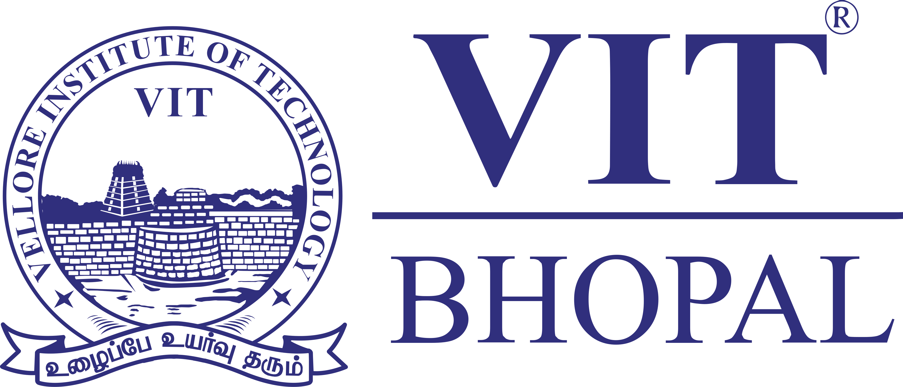
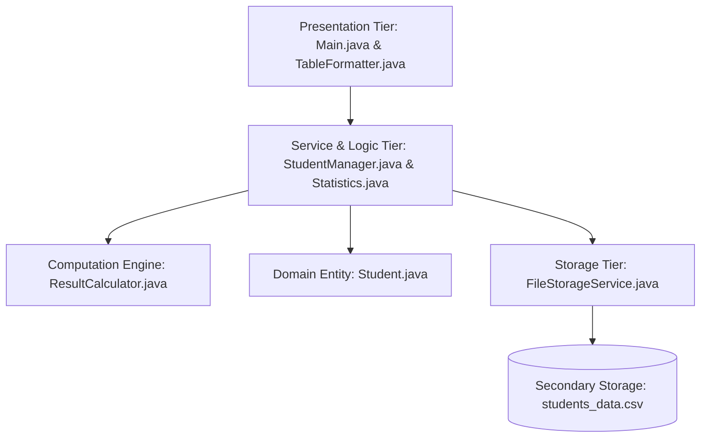

<div align="center">



# Student Result Management System (SRMS)
### VITyarthi - Build Your Own Project | Flipped Course Evaluation

[](https://www.oracle.com/java/)
[](https://en.wikipedia.org/wiki/Object-oriented_programming)
[-success?style=for-the-badge)](https://github.com/)
[](https://github.com/)
[](LICENSE)

---

### **Author Information**
**Student Name:**   BUDDHA S
**Registration Number:** `25BAI11592`  
**Degree Program:** B.Tech in Artificial Intelligence & Machine Learning  
**Department:** School of Computing Science and Engineering (SCSE)  
**Institution:** Vellore Institute of Technology (VIT), Bhopal  

---

</div>

## 📌 1. Project Overview

The **Student Result Management System (SRMS)** is an enterprise-grade, object-oriented console application developed in Java to automate the end-to-end academic evaluation lifecycle for educational institutions. Designed according to industrial Clean Code standards and SOLID design principles, the application eliminates human computation errors, enforces strict data validation constraints, provides deep batch performance analytics, and persists data reliably to secondary storage.

The system manages student demographic profiles and academic performance across core curriculum subjects (**Mathematics**, **Java Programming**, and **Physics**). It features a robust interactive Command Line Interface (CLI) backed by mathematical computation engines, defensive exception handlers, and an ASCII reporting module.

---

## 🚀 2. Key Features

### 🎓 2.1 Academic Record Management (CRUD)
- **Enrollment**: Register new students with automatic duplicate ID detection and boundary validation.
- **Record Retrieval**: View individual comprehensive student report cards or full-batch tabular rosters.
- **Marks Updating**: Safely modify subject scores post re-evaluation with instantaneous grade recalculation.
- **Record Deletion**: Permanent removal of obsolete records with safety confirmation prompts.

### 🔍 2.2 Dual Search Engine
- **Search by ID**: Exact $O(n)$ search returning an official academic report card with subject breakdown and remarks.
- **Search by Name**: Case-insensitive substring query capable of resolving partial names (e.g., searching `"sh"` matches `"BUDDHA S"` and `"Aarav Sharma"`).

### 📊 2.3 University Standard Grading Engine
- Converts percentage aggregates into institutional letter grades (`A+` to `F`) and calculates Grade Point Average (`GPA` on a 10.0 scale).
- Implements subject-level fail checks: failing any individual subject ($< 40.0$) designates an overall result of `FAIL` and letter grade `F`.

### 📈 2.4 Analytical & Statistical Dashboard
- **Batch Extrema**: Identifies the Class Topper and Lowest Scorer.
- **Pass/Fail Metrics**: Computes exact passed count, failed count, and class-wide pass percentage.
- **Subject-Wise Analysis**: Generates average, highest, and lowest marks per discipline.
- **Visual Grade Distribution**: Outputs a formatted ASCII distribution bar chart representing cohort performance.

### 💾 2.5 Data Persistence & Recovery
- Complete file I/O integration via `FileStorageService`.
- Serializes and deserializes records to CSV (`students_data.csv`).
- Corrupt row fault tolerance ensuring malformed CSV entries are safely skipped without halting execution.

### 🧪 2.6 Self-Contained Automated Test Suite
- Built-in `StudentValidationTest` class testing 12 distinct functional scenarios covering constructor constraints, calculation accuracy, exception handling, and file roundtrips.

---

## 🏛️ 3. System Architecture & OOP Principles

The project adopts a decoupled **Three-Tier Architecture**:



### Applied Object-Oriented Principles:
1. **Encapsulation**: All fields in `Student` are private. Access is strictly controlled through validated getters and setters.
2. **Abstraction & Utility Pattern**: Classes such as `ResultCalculator`, `Statistics`, and `TableFormatter` have private constructors and expose clean static utility interfaces.
3. **Data Integrity**: Defensive copies and unmodifiable collections (`Collections.unmodifiableList`) prevent accidental state mutation from external callers.
4. **Custom Exception Hierarchy**: Explicit domain exceptions (`DuplicateStudentException`, `StudentNotFoundException`, `InvalidStudentDataException`) provide structured, descriptive error propagation.

---

## 📊 4. Grading Scheme & Evaluation Metrics

The system enforces the standard university 10-point GPA scale:

| Percentage Range | Letter Grade | Grade Point (GPA) | Academic Performance Classification |
| :---: | :---: | :---: | :--- |
| **90.0% – 100.0%** | `A+` | 10.0 | Outstanding (First Class with Distinction) |
| **80.0% – 89.9%** | `A` | 9.0 | Excellent (First Class) |
| **70.0% – 79.9%** | `B` | 8.0 | Very Good (First Class) |
| **60.0% – 69.9%** | `C` | 7.0 | Good (Second Class) |
| **50.0% – 59.9%** | `D` | 6.0 | Average (Second Class) |
| **40.0% – 49.9%** | `E` | 5.0 | Marginal Pass |
| **< 40.0% (or fail any subject)** | `F` | 0.0 | Fail (Arrears / Needs Improvement) |

---

## 📂 5. Project Directory Structure

```text
.
├── assets/
│   ├── vit_bhopal_logo.png       # High-resolution university logo for documentation
│   └── vit_bhopal_logo.webp      # Raw image asset
├── buh-main/
│   ├── student result management/
│   │   ├── Student.java                  # Domain entity model
│   │   ├── ResultCalculator.java         # Mathematical & grading engine
│   │   ├── StudentManager.java           # Business service layer & CRUD controller
│   │   ├── Statistics.java               # Statistical analytics engine
│   │   ├── TableFormatter.java           # ASCII grid rendering utility
│   │   ├── FileStorageService.java       # CSV data persistence layer
│   │   ├── DuplicateStudentException.java# Domain exception
│   │   ├── StudentNotFoundException.java # Domain exception
│   │   ├── InvalidStudentDataException.java # Domain exception
│   │   ├── StudentValidationTest.java    # Automated unit testing suite
│   │   └── Main.java                     # Application entry point & CLI
│   ├── statement.md              # Scope and problem statement document
│   └── README.md                 # Replicated documentation
├── src/                          # Synced root source folder
├── Project_Report.tex            # Full LaTeX project report source (Overleaf ready)
├── statement.md                  # Project scope specification (VITyarthi guidelines)
├── run.sh                        # One-click compilation and execution script
├── test.sh                       # One-click unit test runner script
└── README.md                     # Main GitHub documentation
```

---

## 💻 6. Installation & Execution Guide

### Prerequisites
- **Java Development Kit (JDK)**: Version 17, 21, or newer.
- Verify installation:
  ```bash
  javac -version
  java -version
  ```

### Step 1: Clone or Navigate to the Project
```bash
git clone <repository-url>
cd <repository-directory>
```

### Step 2: Compile the Java Source Files
Navigate to the source directory and compile:
```bash
cd "buh-main/student result management"
javac *.java
```

### Step 3: Run the Application
```bash
java Main
```

*(Optional Quick Run from Project Root)*:
```bash
chmod +x run.sh && ./run.sh
```

---

## 🧪 7. Running the Automated Tests

To verify mathematical computations, boundary checks, duplicate prevention, and file persistence:

```bash
cd "buh-main/student result management"
javac StudentValidationTest.java
java StudentValidationTest
```

*(Optional Quick Test from Project Root)*:
```bash
chmod +x test.sh && ./test.sh
```

### Expected Output:
```text
=======================================================================
     RUNNING AUTOMATED UNIT & VALIDATION TESTS FOR SRMS
=======================================================================
  [PASS] Student Creation & Getters
  [PASS] Negative Student ID Rejection
  [PASS] Marks Boundary Validation (>100 and <0)
  [PASS] Total & Percentage Calculation
  [PASS] Subject Fail Overrides Overall Result
  [PASS] Grading Scale Verification (A+ to E)
  [PASS] Duplicate ID Prevention Triggered
  [PASS] Search by ID and Case-Insensitive Name
  [PASS] Student Marks Update Verification
  [PASS] Student Record Deletion
  [PASS] Leaderboard Descending Rank Order
  [PASS] File Storage Save and Load Roundtrip
=======================================================================
 TEST SUMMARY: 12 / 12 Tests Passed (100.0% Success Rate)
=======================================================================
[SUCCESS] ALL VERIFICATION TESTS PASSED SUCCESSFULLY!
```

---

## 🖥️ 8. Interactive CLI Walkthrough & Sample Output

### 8.1 Welcome Banner & Main Menu
```text
=======================================================================
       STUDENT RESULT MANAGEMENT SYSTEM (SRMS) - ACADEMIC SUITE       
                    VELLORE INSTITUTE OF TECHNOLOGY                   
                              VIT BHOPAL                              
=======================================================================
 Developer  : BUDDHA S
 Reg. No.   : 25BAI11592
 Program    : B.Tech Computer Science & Engineering (AI & ML)
 Evaluation : VITyarthi - Build Your Own Project
=======================================================================

+------------------- MAIN SYSTEM MENU -------------------+
| Active Records in Memory: 6                            |
+--------------------------------------------------------+
  1)  Enroll New Student Record
  2)  View All Student Records (Tabular Report)
  3)  Search Student (By ID or Name)
  4)  Update Student Subject Marks
  5)  Delete Student Record
  6)  View Class Leaderboard (Ranked by %)
  7)  View Performance & Analytical Statistics
  8)  Save Records to Disk (CSV Storage)
  9)  Load Records from Disk (CSV Storage)
  10) Seed Demo Sample Records (Quick Evaluation)
  11) Exit Application
+--------------------------------------------------------+
Select an option [1-11]: 
```

### 8.2 Formatted Tabular Report (`Option 2`)
```text
+------+----------------------+-------+-------+---------+-------+------------+-------+------+--------+
| ID   | Student Name         | Maths | Java  | Physics | Total | Percentage | Grade | GPA  | Status |
+------+----------------------+-------+-------+---------+-------+------------+-------+------+--------+
| 101  | BUDDHA S       |  96.5 |  98.0 |    94.0 | 288.5 |     96.17% | A+    | 10.0 | PASS   |
| 102  | Aarav Sharma         |  88.0 |  91.5 |    85.0 | 264.5 |     88.17% | A     |  9.0 | PASS   |
| 103  | Rohan Verma          |  74.0 |  82.0 |    78.5 | 234.5 |     78.17% | B     |  8.0 | PASS   |
| 104  | Priya Nair           |  62.0 |  68.0 |    59.0 | 189.0 |     63.00% | C     |  7.0 | PASS   |
| 105  | Ananya Patel         |  42.0 |  50.5 |    45.0 | 137.5 |     45.83% | E     |  5.0 | PASS   |
| 106  | Vikram Singh         |  35.0 |  70.0 |    65.0 | 170.0 |     56.67% | F     |  0.0 | FAIL   |
+------+----------------------+-------+-------+---------+-------+------------+-------+------+--------+
Total Records: 6
```

### 8.3 Analytical Performance Dashboard (`Option 7`)
```text
+===================================================================+
|             ACADEMIC PERFORMANCE & ANALYTICS DASHBOARD            |
|                      VIT BHOPAL UNIVERSITY                        |
+===================================================================+
| Total Enrolled Students  : 6                                      |
| Passed Students          : 5                                      |
| Failed Students          : 1                                      |
| Overall Pass Percentage  : 83.33%                                 |
| Batch Average Percentage : 71.34%                                 |
+-------------------------------------------------------------------+
| TOP PERFORMER & LOWEST SCORER                                     |
+-------------------------------------------------------------------+
| Batch Topper : #101  BUDDHA S          ( 96.17%, Grade A+ ) |
| Lowest Score : #105  Ananya Patel            ( 45.83%, Grade E  ) |
+-------------------------------------------------------------------+
| SUBJECT-WISE PERFORMANCE SUMMARY                                  |
+-------------------------------------------------------------------+
| Subject      | Average Marks | Highest Score | Lowest Score       |
+--------------+---------------+---------------+--------------------+
| Mathematics  |         66.25 |         96.50 |              35.00 |
| Java Lang    |         76.67 |         98.00 |              50.50 |
| Physics      |         70.92 |         94.00 |              45.00 |
+-------------------------------------------------------------------+
| GRADE DISTRIBUTION BREAKDOWN                                      |
+-------------------------------------------------------------------+
| Grade A+ :  1 students ( 16.7%) [###                 ]            |
| Grade A  :  1 students ( 16.7%) [###                 ]            |
| Grade B  :  1 students ( 16.7%) [###                 ]            |
| Grade C  :  1 students ( 16.7%) [###                 ]            |
| Grade D  :  0 students (  0.0%) [                    ]            |
| Grade E  :  1 students ( 16.7%) [###                 ]            |
| Grade F  :  1 students ( 16.7%) [###                 ]            |
+===================================================================+
```

---

## 🔮 9. Future Roadmap

- [ ] **Graphical User Interface (GUI)**: Implement a modern JavaFX / Swing desktop client.
- [ ] **Relational Database Migration**: Transition storage from CSV to SQLite / PostgreSQL using JDBC.
- [ ] **RESTful Web Services**: Expose endpoints via Spring Boot for mobile and web integration.
- [ ] **Multi-Role Authentication**: Role-based access control (RBAC) separating faculty and student views.

---

## 📜 10. Academic Declaration & Acknowledgements

I hereby declare that this project titled **"Student Result Management System (SRMS)"** is my original work submitted in partial fulfillment of the academic requirements for the course evaluation under the **VITyarthi - Build Your Own Project** initiative at **Vellore Institute of Technology (VIT), Bhopal**.

**Author:** BUDDHA S  
**Registration Number:** `25BAI11592`  
**Institution:** VIT Bhopal University  
# Java

# Java

# Java

